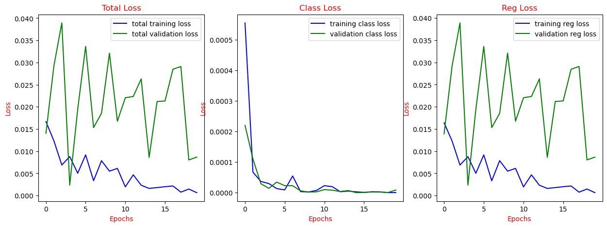

# Face-Tracker
This project for tracking the faces by using object detection techniques. VGG16 is a popular convolutional neural network architecture that is commonly used for image classification tasks. For making a face tracker using VGG16, i will need to customize the network to detect faces in real-time video streams.

Here are the steps i followed to create a face tracker using TensorFlow and VGG16:
- Collected a dataset of my face images and labeled them appropriately as positive or negative examples.
- Preprocessed my face images by resizing and normalizing them to a standardized format.
- Loaded the VGG16 model into TensorFlow.
- Replaced the fully connected layers of the VGG16 model with my own custom layers that are designed for face detection.
- Trained the model on the preprocessed face images using a suitable optimizer and loss function.
- Once the model was trained, used it to detect faces in real-time video streams by applying the model to each frame of the video.

# The Project Pipeline

# The Face Tracker Performance

